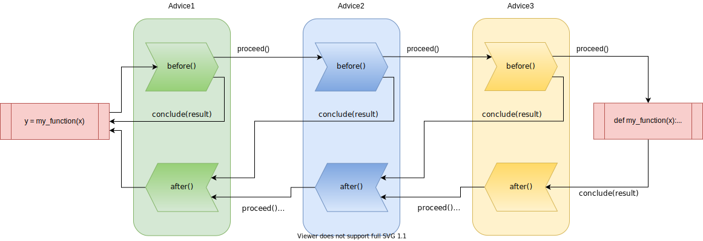

# Bandsaw

 [](https://gitlab.com/kantai/bandsaw/-/commits/mainline)
 [](https://gitlab.com/kantai/bandsaw/-/commits/mainline)

Bandsaw is a python library that allows to split a python script into individual tasks
that can be run separately with different python interpreters and even on different
machines.

## What it does

Bandsaw can be used to create distributed python scripts, that define workflows in
heterogeneous environments and with conflicting dependencies. It is especially meant
for  building complex machine learning processes, that use different machine learning
frameworks like tensorflow or pytorch in a single workflow, or need to run on multiple
different computation platforms, e.g. in different regions due to data restrictions.

## How it works

This works by decorating python functions with the bandsaw @task decorator:

```python
import bandsaw

...

@bandsaw.task
def my_function(x):
    return x

```

This decorator gives bandsaw the opportunity to run additional code before and after the
code within `my_function(x)` is executed. This additional code is defined in 
classes that fulfill the [`Advice`](bandsaw/advice.py) protocol.

When this decorated function is called, bandsaw intercepts the call first and runs the 
`before()` methods of the configured `Advice`s. Then the wrapped function is computed
and afterwards each advice's `after()` method is called.



All callback functions receive a [`Session`](bandsaw/session.py) object as single
argument, which is used for continuing the execution by calling its `proceed()` method.
`Advice`s have the possibility to `conclude()` this early by providing a `Result` on
their own. This shortcuts the computation and can be used for caching results.
Additionally, the session can be serialized and transferred to other python
processes even on other machines using its `save(stream)` and `restore(stream)`
methods.


## Develop

Bandsaw uses [tox](https://tox.wiki/en/latest/index.html) to build and test the library. 
Tox runs all tests on different python versions, can generate the documentation and run
linters and style checks to improve the code quality.
In order to install all the necessary python modules, please run:

```bash
pip install tox
```

Afterwards the tests can be run by just calling

```bash
tox
```

from the project directory.

## Documentation

The latest documentation can always be found under https://docs.kant.ai/bandsaw/latest.
The documentation is written in [Markdown](https://daringfireball.net/projects/markdown/)
and can be found in the `docs` directory of the project. It can be built into static
HTML by using [MkDocs](https://www.mkdocs.org/).


```bash
pip install pdoc3
```


## Release

Releasing new versions of bandsaw is done using [flit](https://flit.readthedocs.io/en/latest/).

```bash
pip install flit
```

In order to be able to publish a new release, you need an account with PyPI or their
respective test environment.

Add those accounts into your `~.pypirc`:
```
[distutils]
index-servers =
  pypi
  pypitest

[pypi]
username: <my-user> 

[pypitest]
repository: https://test.pypi.org/legacy/
username: <my-test-user>
```


### Publishing a new release to test

```bash
flit publish --repository pypitest
```